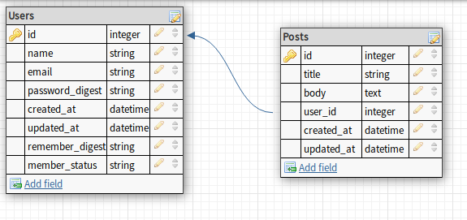

# Members only!

This Rails app allows users to write posts that appear anonymous to non-members. Only users can write posts and see the authors of other posts. Non-logged in users can see the post titles and content but not the authors. The authentication used in this app is created without the use of any gems, instead focusing on thoroughly understanding the basic steps of authentication.

The underlying database schema for this project includes two tables:

[This project](https://www.theodinproject.com/courses/ruby-on-rails/lessons/authentication#project-2-members-only) is part of [The Odin Project](https://www.theodinproject.com) curriculum.
